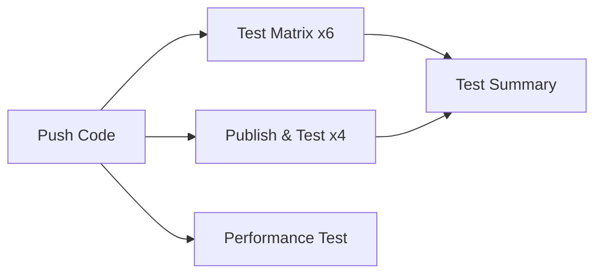

# Cross-Platform Testing Setup

This package contains files to enable automated cross-platform testing of your MultiDbSync application in GitHub Actions.

## 📦 Files Included

1. **`Program.cs`** - Modified console application with automated mode support
2. **`.github/workflows/cross-platform-tests.yml`** - New GitHub Actions workflow for parallel testing
3. **`README-TESTING.md`** - This file

## 🚀 Quick Start

### Step 1: Update Program.cs

Replace the existing `MultiDbSync/MultiDbSync.Console/Program.cs` with the provided `Program.cs` file.

**Key changes:**
```csharp
// New automated mode support
if (args.Length > 0 && (args[0] == "--demo" || args[0] == "--automated" || args[0] == "--ci"))
{
    System.Console.WriteLine("\n🤖 Running in AUTOMATED mode (non-interactive)\n");
    await RunAllDemosAsync();
    System.Console.WriteLine("\n✅ All demos completed successfully!");
    return 0;
}
```

### Step 2: Add GitHub Actions Workflow

Copy `.github/workflows/cross-platform-tests.yml` to your repository at:
```
.github/workflows/cross-platform-tests.yml
```

### Step 3: Push and Watch

```bash
git add .
git commit -m "Add cross-platform testing workflow"
git push
```

GitHub Actions will automatically run tests on all platforms!

## 🎯 What Gets Tested

### Platforms Tested:
- ✅ **Linux x64** (ubuntu-latest)
- ✅ **Linux ARM64** (ubuntu-latest-arm)
- ✅ **Windows x64** (windows-latest)
- ✅ **Windows ARM64** (windows-latest-arm)
- ✅ **macOS Intel** (macos-13)
- ✅ **macOS Apple Silicon** (macos-latest / ARM64)

### Test Matrix Jobs:

Each platform runs:
1. **Build & Unit Tests** - Compiles solution and runs xUnit tests
2. **Integration Test** - Runs the full application with `--demo` flag
3. **Publish Test** - Creates self-contained executable and runs it

### Additional Jobs:

- **Performance Baseline** - Measures execution time on Linux
- **Test Summary** - Aggregates all results

## 🏃 Running Locally

### Interactive Mode (Original)
```bash
dotnet run --project MultiDbSync/MultiDbSync.Console
# Interactive menu appears
```

### Automated Mode (New)
```bash
# Run all demos and exit
dotnet run --project MultiDbSync/MultiDbSync.Console -- --demo

# Also works with these flags:
dotnet run --project MultiDbSync/MultiDbSync.Console -- --automated
dotnet run --project MultiDbSync/MultiDbSync.Console -- --ci
```

### Published Executable
```bash
# Build self-contained executable
dotnet publish MultiDbSync/MultiDbSync.Console \
    --configuration Release \
    --runtime linux-x64 \
    --self-contained true \
    --output ./publish

# Run automated tests
./publish/MultiDbSync.Console --demo
```

## 📊 GitHub Actions Workflow Details

### Workflow Triggers:
- ✅ Push to any branch
- ✅ Pull requests
- ✅ Manual dispatch (workflow_dispatch)

### Parallel Execution:
All 6 platform tests run in parallel for maximum speed!

```
┌─────────────┬─────────────┬─────────────┐
│   Linux     │   Windows   │    macOS    │
│  x64 ARM64  │  x64 ARM64  │  x64 ARM64  │
└─────────────┴─────────────┴─────────────┘
         All running simultaneously
```

### Job Flow:


## 🔍 Viewing Results

### In GitHub UI:

1. Go to **Actions** tab
2. Click on the workflow run
3. View individual job results
4. Check the **Summary** tab for aggregated results

### Artifacts Available:

- **test-results-{platform}** - xUnit test results (TRX files)
- **executable-{platform}** - Self-contained executables (7 days retention)

## ⚙️ Configuration

### Timeout Settings:
```yaml
timeout-minutes: 15  # For test-matrix jobs
timeout-minutes: 20  # For publish-and-test jobs
```

### .NET Version:
```yaml
env:
  DOTNET_VERSION: '10.0.x'
```

### Fail-Fast Behavior:
```yaml
strategy:
  fail-fast: false  # Continue testing all platforms even if one fails
```

## 🐛 Troubleshooting

### ARM64 Runners Not Available

If you get errors about ARM64 runners:

```yaml
# Comment out these sections:
# - os: ubuntu-latest-arm
# - os: windows-latest-arm
```

GitHub ARM64 runners are in preview and may not be available for all accounts.

### Application Hangs in CI

Make sure you're using the `--demo` flag:
```bash
dotnet run -- --demo  # ✅ Correct
dotnet run            # ❌ Will hang waiting for input
```

### Test Failures

Check individual job logs:
1. Click on failed job
2. Expand failed step
3. Review error messages

Common issues:
- Missing dependencies
- Platform-specific EF Core issues
- File path differences (Windows vs Unix)

## 📈 Performance Monitoring

The workflow includes a performance baseline test that measures execution time:

```yaml
# Example output
Execution time: 2.345 seconds
Platform: Ubuntu Latest (x64)
Configuration: Release
```

Track this over time to catch performance regressions!

## 🔒 Security Notes

### Secrets Usage:
This workflow doesn't require any secrets for basic testing.

For production deployments, add:
```yaml
env:
  GITHUB_TOKEN: ${{ secrets.GITHUB_TOKEN }}  # For releases
```

### Artifact Retention:
```yaml
retention-days: 7  # Adjust based on storage needs
```

## 🎨 Customization

### Add New Platforms:

```yaml
matrix:
  include:
    - os: ubuntu-22.04
      arch: x64
      runtime: linux-x64
      display-name: 'Ubuntu 22.04'
```

### Add Custom Tests:

```yaml
- name: Custom Integration Test
  run: |
    dotnet run -- --demo
    # Add your custom validation here
```

### Modify Build Configuration:

```yaml
- name: Build with specific config
  run: |
    dotnet build --configuration Debug
    dotnet build --configuration Release
```

## 📚 Best Practices

1. **Always test locally first:**
   ```bash
   dotnet run -- --demo
   ```

2. **Check logs regularly:**
   - View GitHub Actions logs
   - Monitor test failure patterns

3. **Keep dependencies updated:**
   ```bash
   dotnet list package --outdated
   ```

4. **Use meaningful commit messages:**
   ```bash
   git commit -m "test: Add validation for null customers"
   ```

## 🎯 Next Steps

### Recommended Enhancements:

1. **Add Code Coverage:**
   ```yaml
   - name: Generate coverage
     run: dotnet test --collect:"XPlat Code Coverage"
   ```

2. **Add Benchmark Tests:**
   ```yaml
   - name: Run benchmarks
     run: dotnet run --project Benchmarks
   ```

3. **Add Docker Testing:**
   ```yaml
   - name: Test in Docker
     run: |
       docker build -t multidbsync .
       docker run multidbsync --demo
   ```

4. **Add Database Compatibility Tests:**
   - Test with different SQLite versions
   - Test with SQL Server, PostgreSQL

## 🆘 Support

### Issues?

1. Check existing workflow runs
2. Review job logs
3. Test locally with `--demo` flag
4. Check platform-specific documentation

### Useful Commands:

```bash
# Test build locally
dotnet build MultiDbSync/MultiDbSync.sln --configuration Release

# Test unit tests locally
dotnet test MultiDbSync/MultiDbSync.sln --configuration Release

# Test automated mode locally
dotnet run --project MultiDbSync/MultiDbSync.Console -- --demo

# Publish for specific platform
dotnet publish MultiDbSync/MultiDbSync.Console \
    --configuration Release \
    --runtime win-x64 \
    --self-contained true \
    --output ./publish/win-x64
```

## ✅ Success Criteria

Your workflow is working correctly when:

1. ✅ All 6 platform tests pass (green checkmarks)
2. ✅ Published executables run successfully
3. ✅ Test summary shows all platforms passed
4. ✅ No timeout errors
5. ✅ Performance test completes under 10 minutes

## 🎉 Conclusion

You now have comprehensive cross-platform testing for your MultiDbSync application!

**What you get:**
- ✅ Automated testing on 6 platforms
- ✅ Parallel execution for speed
- ✅ Self-contained executable validation
- ✅ Performance baseline tracking
- ✅ Detailed test reports

Happy testing! 🚀


## 🤖 AI-Assisted Development

This project includes code generated and assisted by large language models (LLMs) such as Claude. While all code has been reviewed and tested, please be aware that some portions were created with AI assistance.

## License
This project is open source and available under the AGPL license.
